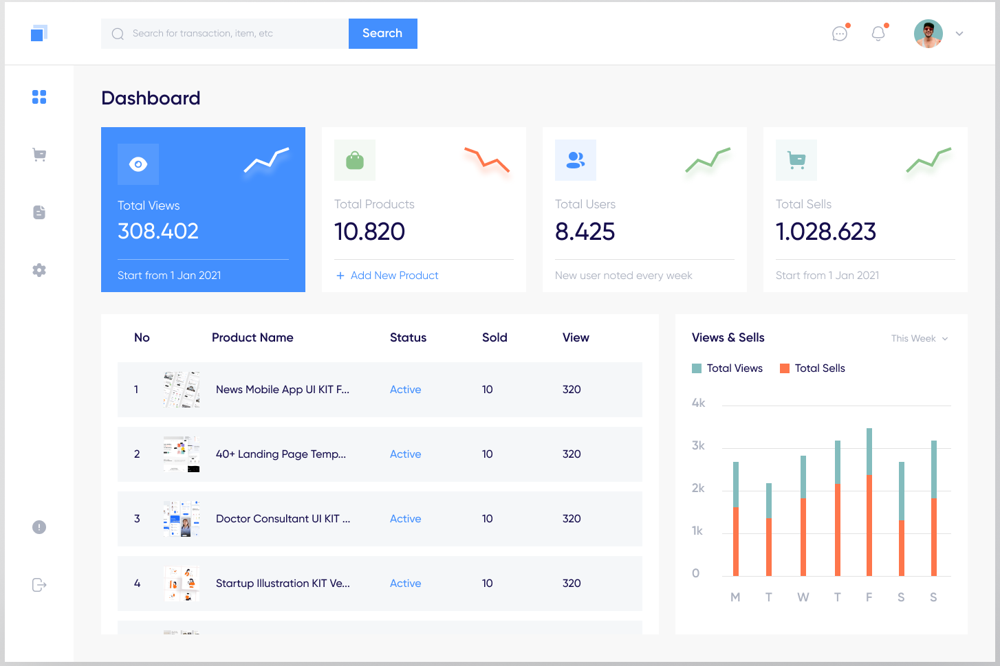
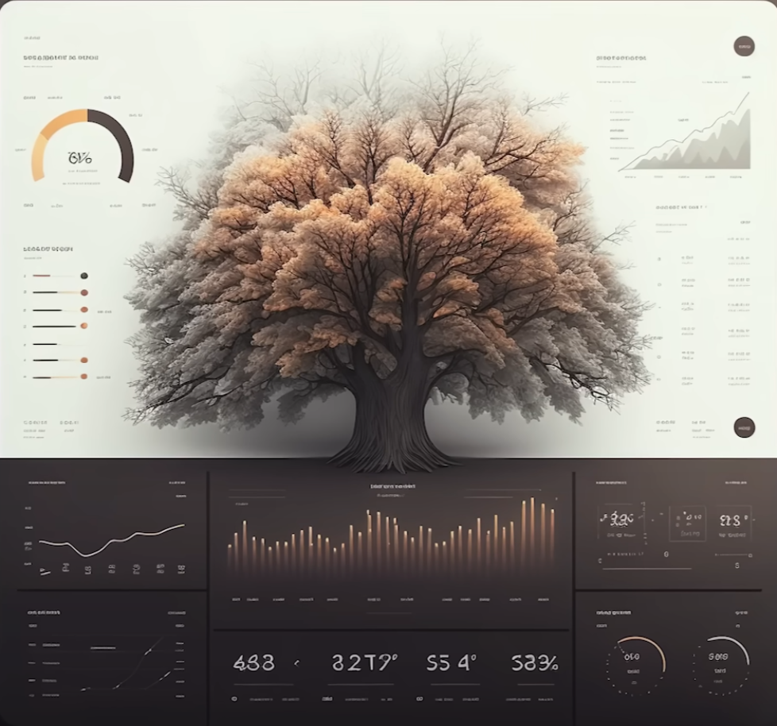
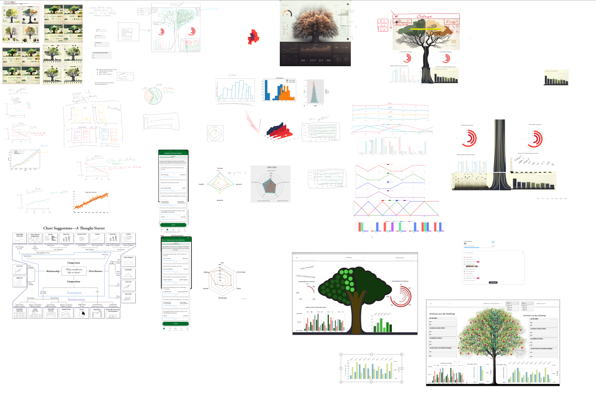
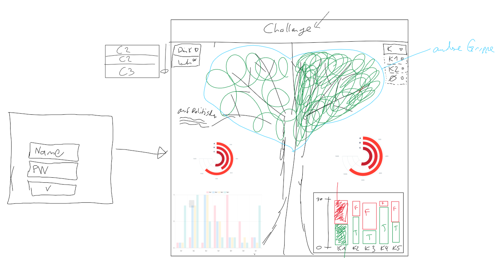

# Milestone 1

### #1 Issue Have clear understanding of current App

> In den letzten Jahren hat sich ein Trend hin zu einem 
> nachhaltigeren Lebensstil entwickelt. Immer mehr Menschen 
> erkennen, dass globalen Ressourcen nicht für immer zur Verfügung 
> stehen werden und wir durch einen bewussteren Lebensstil einen 
> positiven Einfluss auf die Umwelt haben können. Eine erste App 
> (BNE-App) wurde bereits von der FHNW entwickelt, mit welchem 
> Nutzer*innen ein Tagebuch führen können, welche nachhaltige 
> Self-Commitments sie über 4 Wochen einhalten, bzw. ebenfalls 
> erfassen bei welchen Commitments sie Schwierigkeiten gehabt haben. 
> Die BNE-App existiert bereits und wurde auch weitgehend an Schulen 
> verwendet. Somit sollen in ei-nem nächsten Schritt (dieser Arbeit)
> die Daten entsprechend visualisiert werden.
> 
> - Siehe Factsheet BNE-App

### #2 Issue Have understanding which data to use

#### #3 Create list with requirements for Website
> - Soll sowohl für individuelle Nutzer als auch für Gruppen nutzbar sein
> - Soll leute zu einem nachhaltigeren leben motivieren
> - Soll die Daten der BNE-App visualisieren

#### #4 Task Determine which Data is available
> Gemäss Factsheet BNE-App und nach absprache mit Kundin standen folgende Daten 
> zur auswahl:
> - Liste der Self-Commitments
> - Selbsteinschätzung wie es einem ergehen wird beim Self-Commitment
>   - Schwierigkeit - 0-1 (0 = sehr schwierig, 1 = sehr leicht)
>   - Einschränkung - 0-1 (0 = sehr einschränkend, 1 = sehr wenig einschränkend)
>   - Reaktion Umfeld - 0-1 (0 = sehr negativ, 1 = sehr positiv)
>   - Beitrag nachhaltige Entwicklung - 0-1 (0 = sehr wenig, 1 = sehr viel)
>   - Verantwortung/Erwartungen - 0-1 (0 = Verantwortung übernehmen, 1 = Erwartungen nachkommen)
>   - trägt zu nachhaltigem Leben bei - 0-1 (0 = viel, 1 = wenig)
> - Gefühlszustand - 0-1 (0 = sehr schlecht, 1 = sehr gut)
> - Grund für Self-Commitment (Textfeld)
> - Anzahl Tage, an welchen das Commitment eingehalten wurde True/False
> - Massnahmen
>   - Bei dir Selbst
>   - in sozialen Umfeld
>   - auf politischer Ebene
>   - auf Ebene von Produktherstellern
> - Rückblick Selbsteinschätzung (siehe oben)
> - Rückblick Schlüsse die gezogen wurden (aus den Massnahmen siehe oben)

#### #5 Task Determine which Data is needed

> Nach absprache mit Kundin und abklärung der durchführbarkeit der visualisierung
> wurden folgende Daten ausgewählt:
> - Liste der Self-Commitments
> - Anzahl Tage, an welchen das Commitment eingehalten wurde True/False
> - Rückblick Schlüsse die gezogen wurden (aus den Massnahmen siehe oben)
> - Rückblick Selbsteinschätzung (siehe oben)
> - Gefühlszustand - 0-1 (0 = sehr schlecht, 1 = sehr gut)

### #6 IssuePlanning of Website

#### #7 Task State of the Art-Analyse (Website)
> Wir wollten keine einfache Webseite erstellen sondern einen wow effekt erzeugen. Daher ist unsere Grundidee
> 
> von einem Dashboard schnell auf etwas künstlerisches umgeschwenkt. Wir haben uns inspirieren lassen.
> 

#### #8 Task Create Low-Fi Design
> Entwicklung des Designs:
> 
> 
> 

#### #9 Have understanding of Sustainability
> siehe Dokumente in About Sustainability

