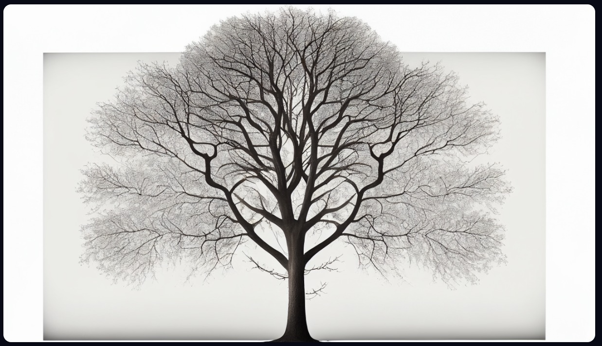
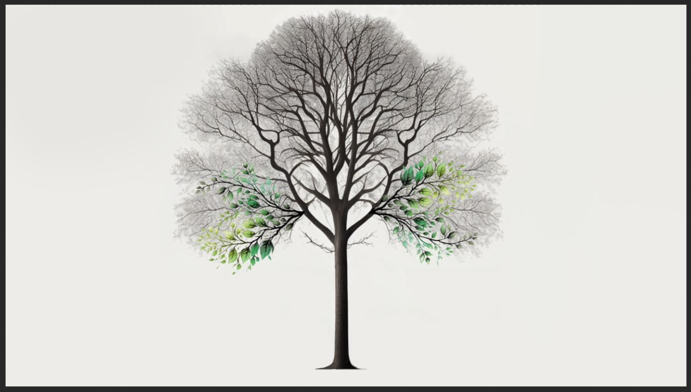
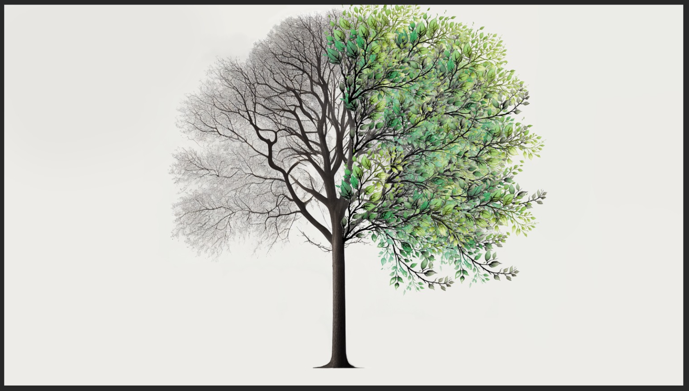
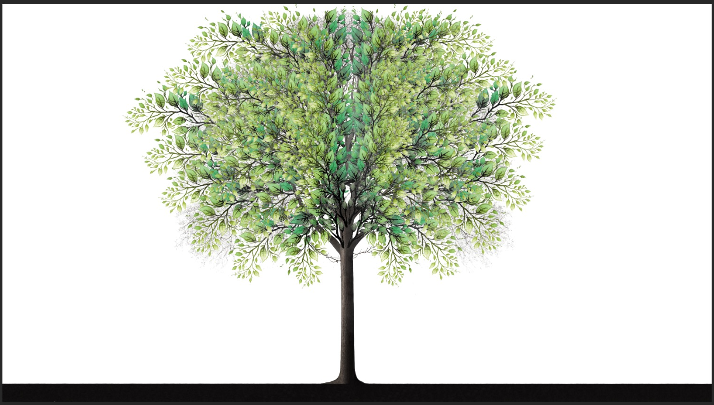
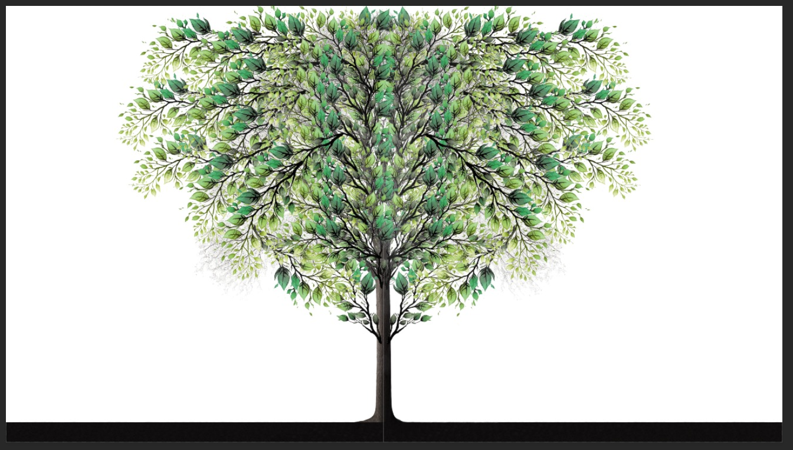
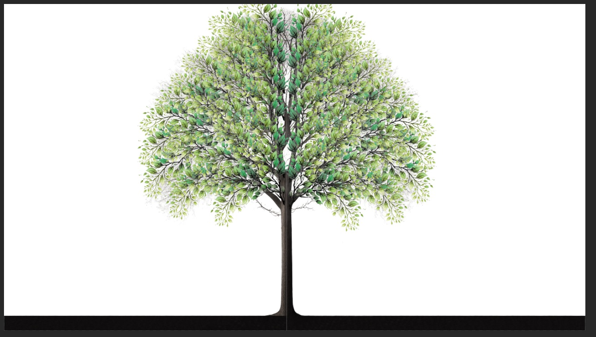
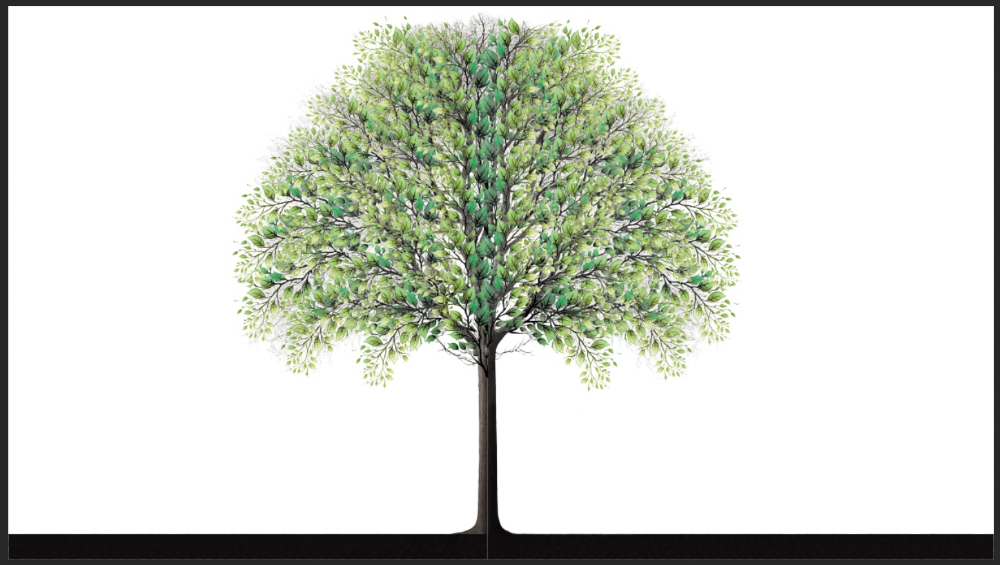
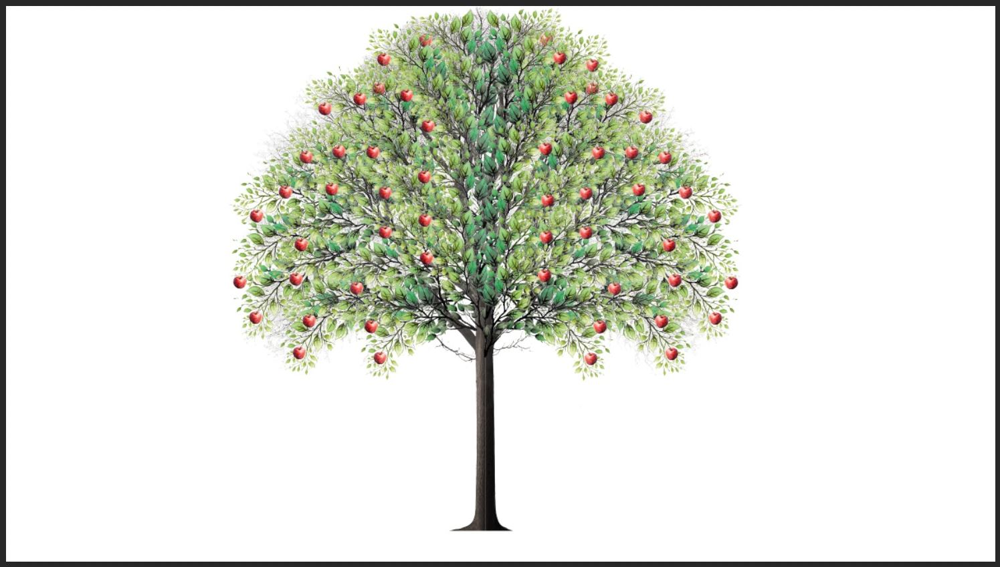
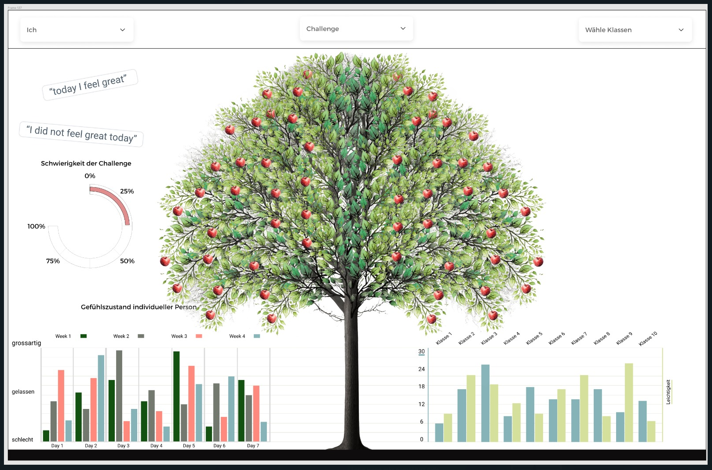
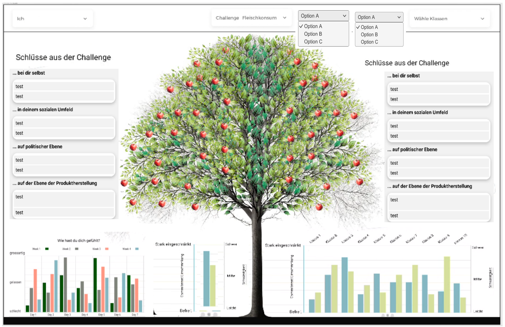

# Milestone 2

### #10 Create High-Fidelity Design
> Entwicklung des Designs:
> 
> 
> 
> 
> 
> 
> 
> 
> 
> 
> 
> 
> ### #11 Usability Tests
> Testpersonen wurden nicht rechtzeitig gefunden, daher wurden die Usability Tests auf
> den nächsten Milestone verschoben und werden dann mit der finalen Version durchgeführt.
